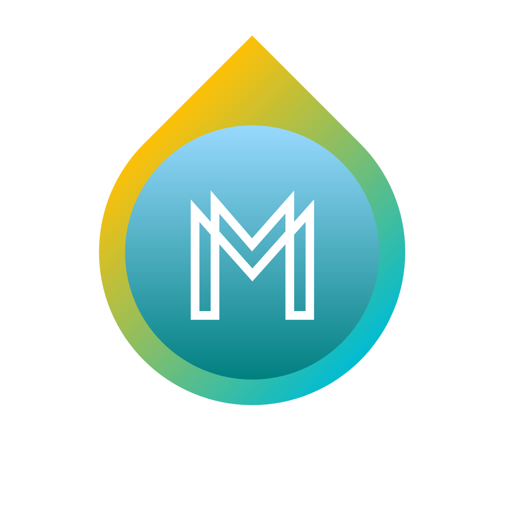

# Mine CSS Framework

Mine is a **mordern css framework** based on [Flexbox](https://developer.mozilla.org/en-US/docs/Learn/CSS/CSS_layout/Flexbox) & [jQuery](https://github.com/jquery/jquery)

[](https://github.com/SuNiL-Chau/Mine-CSS-Framework/issues) [](https://github.com/SuNiL-Chau/Mine-CSS-Framework/stargazers) [](https://github.com/SuNiL-Chau/Mine-CSS-Framework/network)

## Installation
*NPM & CDN installations are coming soon*

**But if you wanna try the go ahead and fork the repo & import css & js from [dist/](/dist/) folder**

**Note:** No need to install dependencies if you are not contributing. Then add css at the top of page & js at the end of page.
```html
<link rel="stylesheet" href="/dist/css/mine.min.css">
<script src="/dist/js/Mine.bundle.js"></script>
```

## Usage
Check out **[/docs](/docs/)** directory for the examples of usages. 

## Support
Want to connect then go ahead & ping me on [](https://twitter.com/intent/tweet?text=Wow:&url=https%3A%2F%2Fgithub.com%2FSuNiL-Chau%2FMine-CSS-Framework) .

## Roadmap 

The below are the upcoming features:
- Card
- Nav
- Navbar
- Hero
- Form & Inputs
- Pagination
- Progress Bars
- Accordian
- Tooltip
- Slider
- Social Box
- ...... Needs to be decided

Feeling to contribute or have and idea go ahead & contribute by creating issues & putting pull requests, but before that check below [contributing](#Contributing).

## Contributing
Thinking to contribute? Well, you are welcome :tada:
To contribute to this project go ahead and checkout [contribute.md](/CONTRIBUTING.md) guide and then you can contribute :tada:.

## License
[](https://github.com/SuNiL-Chau/Mine-CSS-Framework/blob/master/LICENSE.md)

## Project Status
*The project has slowed down for a while*
__Note:__ *I'm Still working on it it might be unstable in one or the another way.*
